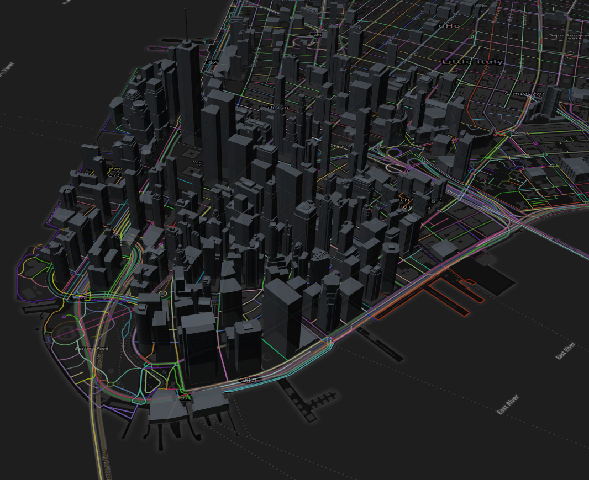
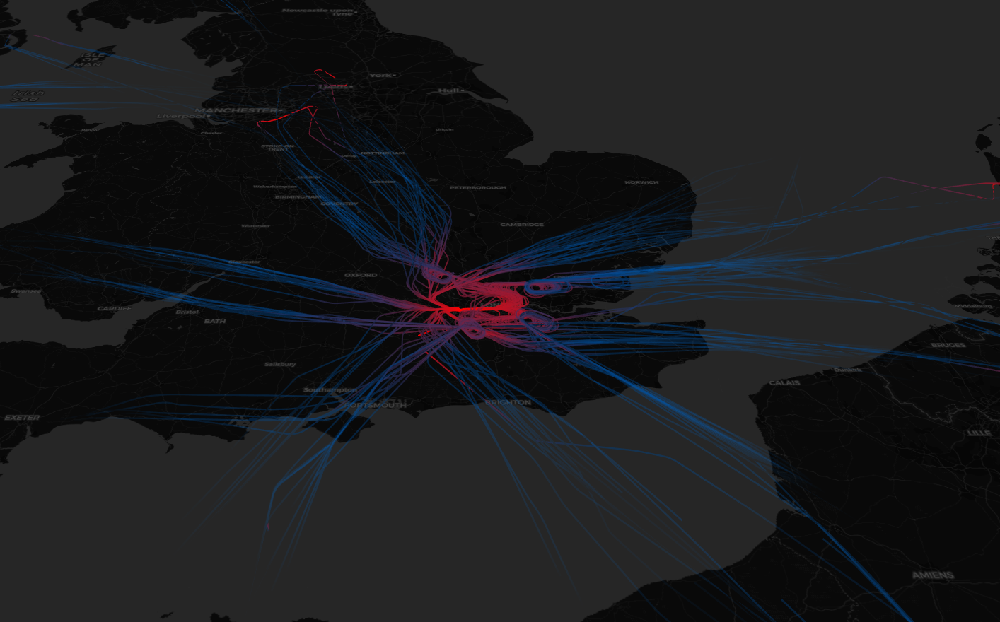

# maptalks-deckgl
The plugin to play deck.gl with maptalks.js

## use?

```js

   let deckglLayer = new maptalks.DeckGLLayer('kkkk', {});
        map.addLayer(deckglLayer);
        


        addHexagonLayer();
        function addHexagonLayer() {
            d3.csv('https://raw.githubusercontent.com/uber-common/deck.gl-data/master/examples/3d-heatmap/heatmap-data.csv',
                (error, response) => {
                    let data = response.map(d => [Number(d.lng), Number(d.lat)]);
                    const COLOR_RANGE = [
                        [1, 152, 189],
                        [73, 227, 206],
                        [216, 254, 181],
                        [254, 237, 177],
                        [254, 173, 84],
                        [209, 55, 78]
                    ];

                    const LIGHT_SETTINGS = {
                        lightsPosition: [-0.144528, 49.739968, 8000, -3.807751, 54.104682, 8000],
                        ambientRatio: 0.4,
                        diffuseRatio: 0.6,
                        specularRatio: 0.2,
                        lightsStrength: [0.8, 0.0, 0.8, 0.0],
                        numberOfLights: 2
                    };
                    const options = {
                        radius: 1000,
                        coverage: 1,
                        upperPercentile: 100
                    }

                    const hexagonLayer = {
                        layerType: "HexagonLayer",//is import ,is deck.gl Layer Type
                        id: 'heatmap',
                        colorRange: COLOR_RANGE,
                        data,
                        elevationRange: [0, 1000],
                        elevationScale: 250,
                        extruded: true,
                        pickable: true,
                        getPosition: d => d,
                        onHover: info => { console.log(info) },
                        lightSettings: LIGHT_SETTINGS,
                        opacity: 1,
                        ...options
                    };
                    deckglLayer.setProps({
                        layers: [hexagonLayer]
                    });
                });
        }
```

## gallery





